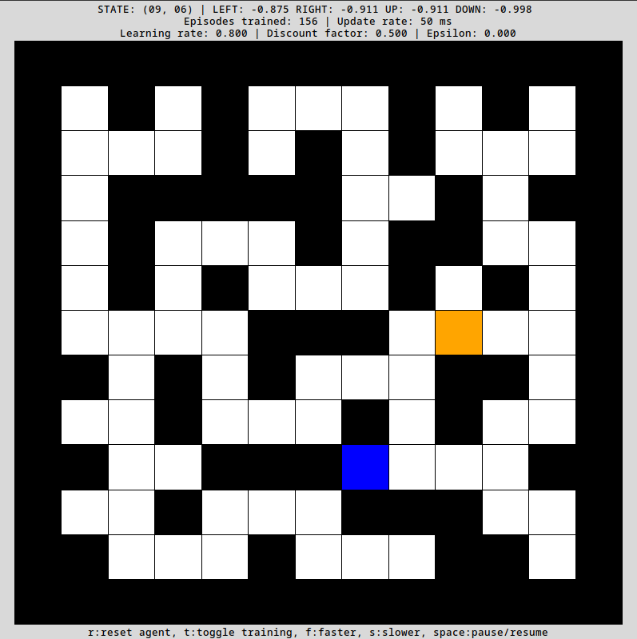
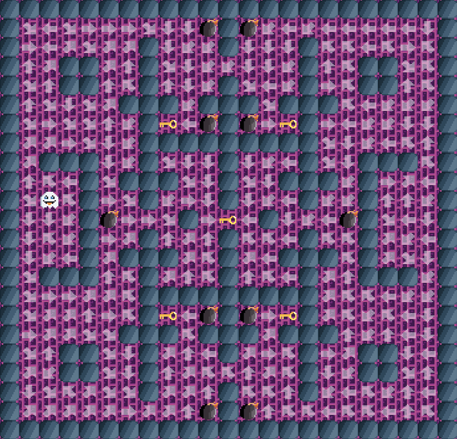

# Tutorial: Løs labyrint med Q-læring

Vi skal nå utvide [programmet vårt fra forrige uke](https://inf100.ii.uib.no/lab/8/#tutorial-5-april-labyrint) slik at agenten lærer seg å løse en labyrinten ved hjelp av Q-læring, en form for forsterkende læring (reinforcement learning).

Det ferdige prosjektet kan se noe slikt ut:

Den oransje ruten er agenten vår som prøver å finne fram til den blå målruten. Når vi starter programmet så har agenten ingen kunnskap om labyrinten. Gjennom å utforske labyrinten, samler agenten gradvis erfaring og blir til slutt ekspert på å finne målet (eller målene). 

Kunnskapen agenten lærer lagres i en såkalt Q-tabell som representerer verdien av å utføre en spesifikk handling (gå venstre, høyre, opp eller ned) i en gitt tilstand (agentens posisjon).

Agenten mottar tilbakemelding på sine handlinger via en belønningsfunksjon. For eksempel, å gå inn i veggen gir en sterk negativ belønning. Å nå målruten gir en sterk positiv belønning. Å gå til en ny åpen rute gir en svak negativ belønning (siden vi vil at agenten skal lære seg å finne den raskeste veien til målet).

## Innhold

### &#128187; Tutorial

1. [Før du begynner (start her)](./del_1.md)
2. [Resett agenten](./del_2.md)
3. [Styr hastigheten](./del_3.md)
4. [Opprett Q-tabell](./del_4.md)
5. [Belønningsfunksjonen](./del_5.md)
6. [Lag variabler](./del_6.md)
7. [Høyeste Q-verdi](./del_7.md)
8. [Retning med høyeste Q-verdi](./del_8.md)
9. [ε-grådig strategi](./del_9.md)
10. [Q-læringsalgoritmen](./del_10.md)

Når du er ferdig med alle delene, kan du ta en titt på listen nedenfor dersom du ønsker å forbedre programmet ditt.

### &#128210; Slides

[Gå til slides om Q-læring.](./slides/main.pdf)

---

## Utvidelser

Her er en liste over forslag til mulige forbedringer og eksperimenter du kan velge å implementere:

- Prøv forskjellige verdier av læringsparametrene $\alpha$, $\gamma$ og $\epsilon$.
- Automatisk resett agenten dersom den bruker for mange steg uten å nå en målrute.
- La agenten gå diagonalt (utvid $\mathcal{A}$ med fire nye retninger).
- Prøv å ha flere enn bare én målrute i labyrinten.
- Lag fin grafikk.
- Lag en labyrintgenerator som automatisk lager en løsbar labyrint...
- ...eller lag et eget program for å tegne labyrinter.
- Lag nye rutetyper. For eksempel, lag en bomberute som gir stor negativ belønning og resetter agenten.
- Tegn en pil i de åpne rutene som peker i den retningen som har høyest Q-verdi (se hvordan pilene endrer seg under trening).
- Start med en tom Q-tabell og legg til tilstander ved behov. Med andre ord, start med en Q-tabell som kun inneholder en rad for startposisjonen `agent_pos` og utvid Q-tabellen når agenten utforsker en nye ruter.
- Utforsk dyp Q-læring (Deep Q-learning) hvor vi erstatter Q-tabellen med et nevralt nettverk. Se for eksempel [her (link)](https://www.youtube.com/watch?v=AhyznRSDjw8) og [her (link)](https://huggingface.co/learn/deep-rl-course/unit3/introduction).

**Eksempel/inspirasjon:**

