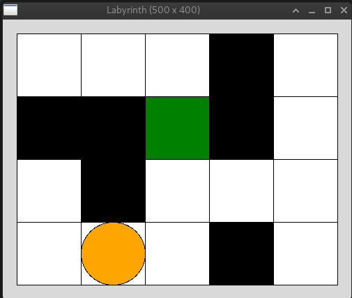

# &#129417; Del 1: Før du begynner

For å fullføre denne tutorialen må du først ha gjort steg 1-7 i del 1 ([link til del 1](https://inf100.ii.uib.no/lab/8/#tutorial-5-april-labyrint)) hvor du implementerte selve labyrinten, grafikken og agentens evne til å bevege seg rundt i labyrinten.

Du skal med andre ord nå ha en mappe med følgende filer:

```
laby_main.py
laby_maze.py
laby_view.py
laby_ai.py
level1.lev
level2.lev
```

Når du kjører `laby_main.py` skal du få opp et vindu som ser noe slikt ut (når `app.auto_mode == True`):


- Labyrinten leses fra en av filene `level*.lev` og du skal kunne flytte agenten rundt med piltastene når `app.auto_mode` er `False`.
- Automodus skal kunne skrus av og på ved å trykke `a`.
- Når man trykker `ESC` (escape) så skal agenten flyttes til en tilfeldig åpen rute (rute med verdien `0`).
- Agenten skal gå ett steg i retning bestemt av `get_direction` fra `laby_ai.py` dersom du trykker `m`.

Hvis programmet ditt gjør alt dette så kan du gå videre.

---

[Gå til del 2 >>](./del_2.md)
