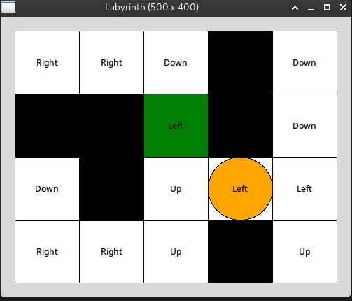

# &#129504; Del 10: Implementer Q-læringsalgoritmen

Prøv å kjør programmet du har laget så langt og legg merke til at agenten aldri blir noe flinkere til å finne mål.

I funksjonen `timer_fired` i filen `laby_main.py` flyttes nå agenten i en tilfeldig retning dersom `app.auto_mode` er `True`. Vi skal nå bruke Q-læring for å gjøre agenten smartere.

I funksjonen `timer_fired` dersom `app.auto_mode` er `True`, skal vi, i stedet for å flytte agenten tilfeldig, gjøre følgende steg:

1. Bruk $\epsilon$-grådig strategi til å velge en retning $a_t$ ved å kalle funksjonen `get_direction(...)` fra `laby_ai.py`. Lagre denne retningen i en variabel `direction`.
2. Beregn belønningen $R(s_t, a_t)$ ved å kalle `reward_function` fra `laby_ai.py`.
3. Lagre `app.agent_pos` i en ny variabel `prev_pos`. Variabelen `prev_pos` er vår tilstand $s_t$.
4. Flytt agenten i retning `direction` ved å kalle `move_agent_in_direction` fra `laby_maze.py`. Variabelen `app.agent_pos` er vår $s_{t+1}$.
5. Finn den nåværende Q-verdien $Q(s_t, a_t)$ i `app.q_table` ved å bruke `prev_pos` og `direction`.
6. Finn estimert fremtidig belønning $\max_{a\in\mathcal{A}}Q(s_{t+1}, a)$ ved å kalle `get_maximum_q_value` med `app.agent_pos` og `app.q_table`.
7. Regn ut den nye Q-verdien med formelen $(1-\alpha)Q(s_t, a_t) + \alpha\left(R(s_t, a_t) + \gamma\max_{a\in\mathcal{A}}Q(s_{t+1}, a)\right)$.
8. Oppdater $Q(s_t, a_t)$ til å være den nye Q-verdien fra forrige steg.

**Merk:** Utfør stegene i samme rekkefølge som oppgitt.

Dersom du har gjort alt riktig så langt så skal agenten nå lære seg å løse labyrinten rimelig raskt.

## Feilsøking

Et godt tips er å endre funksjonen `draw_maze` i filen `laby_view.py` slik at retningen med høyest Q-verdi for hver rute blir skrevet i midten av ruten. Du kan bruke funksjonen `get_policy_direction` og `app.q_table[row][col]` til å finne retningen. Da vil programmet se noe slikt ut etter noen episoder dersom agenten lærer slik den skal: 

Hvis du ikke finner ut av det på egenhånd, spør gjerne en gruppeleder eller bruk Discord-kanalen.

---

[<< Gå til del 9](./del_9.md) | [Tilbake til forsiden](./README.md)
