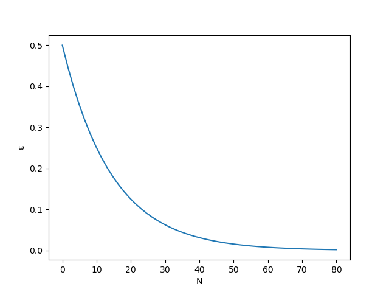

## Del 2: Q-læring

Vi skal nå gjøre det mulig for agenten å lære gjennom å utforske labyrinten på egenhånd. Målet er å lære en policy som er optimal med tanke på målet vårt: Fra en gitt posisjon i labyrinten, finn den beste handlingen, altså retningen å gå i, for å nå målet raskest mulig.

Vi skriver $\mathcal{S}$ for mengden av alle tilstander (states) agenten vår kan være i. Det vil i vårt tilfelle være alle rutene i labyrinten. For eksempel, dersom vi har en labyrint med 3 rader og 3 kolonner så har vi 

$$
\mathcal{S} = \left\lbrace(0,0),(0,1),(0,2),(1,0),(1,1),(1,2),(2,0),(2,1),(2,2)\right\rbrace.
$$

**Merk:** Vi tar med alle rutene i labyrinten i $\mathcal{S}$ selv om noen kan være veggruter og målruter. Dette er ikke nødvendig, men det gjør noen ting litt lettere og det er ikke noe problem siden labyrintene er så små.

Mengden av alle handlinger (actions) kaller vi for $\mathcal{A}$. I vårt tilfelle er handlingene de forskjellige retningene vi kan gå i:

$$
\mathcal{A} = \left\lbrace\text{venstre}, \text{høyre}, \text{opp}, \text{ned}\right\rbrace.
$$

Q-funksjonen er en funksjon $Q\colon \mathcal{S}\times\mathcal{A}\to\mathbb{R}$. Det vil si at for hvert par $(s, a)$ hvor $s$ er en tilstand og $a$ er en handling så gir Q-funksjonen én verdi $Q(s,a)$ til dette paret. Til å begynne med setter vi $Q(s,a)=0$ for alle par $(s,a)\in\mathcal{S}\times\mathcal{A}$. Gjennom læringsprosessen oppdateres Q-funksjonen hver gang agenten utfører en handling (akkurat hvordan dette gjøres kommer vi til snart). Vi kan derfor tenke oss at agentens erfaring lagres i Q-funksjonen.

For å være litt mer konkret: La oss si at agenten er i posisjon $(c, r)$ i labyrinten slik at tilstanden $s=(c, r)$. Da har vi fire valg for $a$ i vårt tilfelle som gir oss fire verdier $Q(s, \text{venstre})$, $Q(s, \text{høyre})$, $Q(s, \text{opp})$ og $Q(s, \text{ned})$ (dette er bare fire tall). Over tid vil vi at det optimale valget for $a$ skal ha høyest verdi av disse fire verdiene. Det optimale valget for $a$ er den handlingen som gjør at vi kommer raskest til målruten.

### 2.a: Opprette Q-funksjonen 

Siden vi har endelig mange tilstander og handlinger så kan vi representere Q-funksjonen som en tabell. La oss kalle denne **Q-tabellen**.

For eksempel, hvis labyrinten vår har 3 rader og 3 kolonner, så ser Q-tabellen slik ut før agenten har lært noe: 

|$s$ \\ $a$|$\text{venstre}$|$\text{høyre}$|$\text{opp}$|$\text{ned}$|
|:------:|:--------------:|:------------:|:----------:|:----------:|
|$(0,0)$ | 0.0			  | 0.0 		 | 0.0		  | 0.0 	   |
|$(0,1)$ | 0.0			  | **0.0**		 | 0.0		  | 0.0 	   |
|$(0,2)$ | 0.0			  | 0.0 		 | 0.0		  | 0.0 	   |
|$(1,0)$ | 0.0			  | 0.0 		 | 0.0		  | 0.0 	   |
|$(1,1)$ | 0.0			  | 0.0 		 | 0.0		  | 0.0 	   |
|$(1,2)$ | 0.0			  | 0.0 		 | 0.0		  | 0.0 	   |
|$(2,0)$ | 0.0			  | 0.0 		 | 0.0		  | 0.0 	   |
|$(2,1)$ | 0.0			  | 0.0 		 | 0.0		  | 0.0 	   |
|$(2,2)$ | 0.0			  | 0.0 		 | 0.0		  | 0.0 	   |

I tabellen ovenfor har vi tilstanden (agentens posisjon) i kolonnen helt til venstre og **Q-verdiene** til de forskjellige handlingene vi kan utføre i denne posisjonen til høyre for tilstanden. For eksempel så er $Q((0,1), \text{høyre})$ markert med fet skrift i tabellen.

Vi skal nå opprette en slik "tom" Q-tabell.

**1)** Lag en funksjon `generate_q_table(n_row, n_col)` i filen `learning.py`. Parameterene `n_row` og `n_col` er henholdsvis antall rader og kolonner i labyrinten (begge heltall). Returner et oppslagsverk (dictionary) med nøkkelverdier `(col, row)` for alle mulige posisjoner i labyrinten (inkludert veggruter og målruter). For hver nøkkelverdi `(col, row)` skal vi ha verdien `{"left": 0.0, "right": 0.0, "up": 0.0, "down": 0.0}`. Vi har med andre ord laget et oppslagsverk av oppslagsverk for å lagre Q-tabellen.

Q-verdien som korresponderer til å gå til venstre når agenten er i posisjon $(1,2)$ kan vi nå få tak i via `q_table[(1,2)]["left"]`. For å få tak i Q-verdien for å gå ned når agenten er i posisjon $(1,0)$, leser vi verdien til `q_table[(1,0)]["down"]`, og så videre.

**Spørsmål:** Hvis vi har en labyrint med $n$ rader og $m$ kolonner, hvor mange verdier må vi lagre i Q-tabellen?

<details>
  <summary><b>&#128161; Hint</b></summary>

- For å iterere over alle par `(col, row)` hvor `0 <= col < n_col` og `0 <= row < n_row` kan du benytte to nøstede for-løkker...
- ... eller du kan benytte `itertools.product` sammen med `range` (prøv å kjør eksempelet nedenfor).

```python
from itertools import product
for pos in product(range(6), range(4)):
    print(pos)
```
</details>


&#128203; **Test implementasjonen din:** Lagre filen [`test_generate_q_table.py`](./tests/test_generate_q_table.py) i samme mappe som de andre filene og kjør den for å teste koden din. Hvis du får `All test passed!` kan du gå videre.

**2)** I funksjonen `app_started` i filen `main.py`, lag en variabel `app.q_table = generate_q_table(n_row, n_col)` (etter at `app.maze` er definert) hvor `n_row = len(app.maze)` og `n_col = len(app.maze[0])`.

---

### 2.b: Belønningsfunksjonen

For at agenten skal kunne lære noe må vi bestemme hva som skal belønnes og hva som skal straffes (negativ belønning). Dette gjøres ved hjelp av en funksjon kalt **belønningsfunksjonen** (reward function) $R$ som er en funksjon $R\colon \mathcal{S}\times\mathcal{A}\to\mathbb{R}$.

For enhver tilstand $s$ og enhver handling $a$ får vi et flyttall $R(s,a)$ som bestemmer hvor bra eller dårlig det var å utføre handling $a$ i tilstand $s$.

Lag en funksjon `reward_function(agent_pos, direction, maze)` i filen `learning.py` som tar in følgende tre parametere:

1. `agent_pos`: en tupel `(col, row)` som gir oss agentens posisjon i labyrinten,
2. `direction`: en streng som kan ta verdiene `"left"`, `"right"`, `"up"` eller `"down"` som sier hvilken posisjon vi skal gå, og
3. `maze`: en 2D-liste som representerer labyrinten.

Hvis naboruten til `agent_pos` i retning `direction` er en åpen rute skal funksjonen returnere `-0.1`. Hvis naboruten er en veggrute skal funksjonen returnere `-1.0`, og hvis naboruten er en målrute skal funksjonen returnere `1.0`.

<details>
  <summary><b>&#128161; Hint</b></summary>

- Bruk funksjonen `coord_in_direction` fra filen `maze.py` for å finne koordinatene i retning `direction` fra `agent_pos`.
- Returner belønningsverdi basert på verdien av `maze` for den nye posisjonen. Bruk gjerne funksjonene `is_wall` og `is_goal` fra `maze.py` for å avgjøre hva belønningen skal være. 

</details>

&#128203; **Test implementasjonen din:** Lagre filen [`test_reward_function.py`](./tests/test_reward_function.py) i samme mappe som de andre filene og kjør den for å teste koden din. Hvis du får `All test passed!` kan du gå videre.

---

### 2.c: $\epsilon$-grådig Q-læring

La $\epsilon$ være et tall mellom $0$ og $1$. Vi ønsker at agenten utfører en tilfeldig handling med sannsynlighet $\epsilon$ og at agenten utfører handlingen med høyest Q-verdi med sannsynlighet $1-\epsilon$. Dette kalles $\epsilon$-grådig Q-læring.

På denne måten lar vi agenten utforske tilfeldige retninger slik at den kan lære mer. Samtidig lar vi agenten også bruke tidligere erfaring noen ganger. Senere skal vi la $\epsilon$ bli gradvis mindre under treningen slik at agenten i større og større grad velger retning basert på Q-tabellen.

---

**2.c.1) Finn optimal retning basert på Q-tabellen** 

Lag en funksjon `get_policy_direction(agent_pos, q_table)` i filen `learning.py`. Denne funksjonen tar inn to parametere: en tupel av heltall `agent_pos` som angir agentens posisjon og `q_table` som representerer en Q-tabell. Funksjonen skal returnere en streng (`"left"`, `"right"`, `"up"` eller `"down"`) som angir retningen (handlingen) som korresponderer til høyest Q-verdi i angitt posisjon (tilstand). Med andre ord, funksjonen skal returnere $\pi_*(s)=\arg\max_{a\in\mathcal{A}}Q(s,a)$ hvor $s$ er `agent_pos`.

<details>
  <summary><b>&#128161; Hint</b></summary>

- Verdien til `q_table[agent_pos]` er et oppslagsverk med nøkkelverdier `"left"`, `"right"`, `"up"` og `"down"`. Returner nøkkelverdien som peker på den høyeste verdien.
- En mulighet er å bruke parameteren `key` for funksjonen `max` (se eksempelet nedenfor).

```python
foo = {"a": 0.0, "b": 1.0, "c": 0.5, "d": -1.0}
max_key = max(foo, key=foo.get)
print(max_key)
```

- Hva skjer hvis du skriver `max(foo)` i eksempelt ovenfor? Hvorfor gir ikke det resultatet vi ønsker?

</details>

&#128203; **Test implementasjonen din:** Lagre filen [`test_get_policy_direction.py`](./tests/test_get_policy_direction.py) i samme mappe som de andre filene og kjør den for å teste koden din. Hvis du får `All test passed!` kan du gå videre.

---

**2.c.2) Velg tilfeldig retning** 

Lag en funksjon `decide_direction(agent_pos, q_table, epsilon)` i filen `learning.py`. Funksjonen skal ta inn tre parametere: en tupel av heltall `agent_pos` som angir agentens posisjon, et oppslagsverk `q_table` som representerer en Q-tabell, og et flyttall `epsilon` mellom `0.0` og `1.0`. Funksjonen skal returnere en streng (`"left"`, `"right"`, `"up"` eller `"down"`) som angir retningen (handlingen) agenten skal gå. Retningen som returneres skal enten være tilfeldig (med sannsynlighet `epsilon`) eller den som har høyest Q-verdi (med sannsynlighet `1 - epsilon`).
 
<details>
  <summary><b>&#128161; Hint</b></summary>

- Koden nedenfor skriver ut `Hello` med sannsynlighet `0.8` og skriver ut `World` med sannsynlighet `0.2`.
```python
import random

epsilon = 0.8

if random.random() < epsilon:
    # Runs with probability epsilon
    print("Hello")
else:
    # Runs with probability 1 - epsilon
    print("World")
```

- For å velge et tilfeldig element fra en liste kan du bruke funksjonen `random.choice`. For eksempel `random.choice(["Hello", "Hey", "Howdy"])` returnerer en av strengene `"Hello"`, `"Hey"` eller `"Howdy"` med lik sannsynlighet (uniformt fordelt).

- Bruk funksjonen `get_policy_direction` fra forrige deloppgave for å finne den beste retningen i følge Q-tabellen. 

</details>

---

**2.c.3) Lag nye variabel** 

I funksjonen `app_started` i filen `main.py` lag en ny variabel `app.epsilon` med verdien `0.5`.

---

**2.c.4) La agenten utforske** 

I slutten av funksjonen `timer_fired` i filen `main.py`, implementer følgende:

1. Lag en variabel `direction` med returverdien du får ved å kalle `decide_direction` (fra `learning.py`) med parametrene `app.agent_pos`, `app.q_table` og `app.epsilon`.
2. Hvis ruten i retning `direction` fra `app.agent_pos` *ikke* er en veggrute, flytt agenten dit.

<details>
  <summary><b>&#128161; Hint</b></summary>

Oppdater `app.agent_pos` ved å bruke funksjonen `move_agent` fra `maze.py`. 

</details>

---

**2.c.5) Resett agenten** 

Vi skal nå resette agenten når den når en målrute. I slutten av funksjonen `timer_fired` i filen `main.py`, implementer følgende: Hvis agenten havner på en målrute, sett variabelen `app.agent_pos` til posisjonen til en tilfeldig åpen rute.

<details>
  <summary><b>&#128161; Hint</b></summary>

- Bruk funksjonen `is_goal` fra `maze.py` for å sjekke om agenten har havnet på en målrute.
- Bruk funksjonen `get_random_position` fra `maze.py` for å finne en tilfeldig åpen rute.

</details>

&#128203; **Test implementasjonen din så langt:** Hvis du nå kjører `main.py` skal agenten gå tilfeldig rundt i labyrinten, og hvis agenten når en målrute skal agenten settes på en tilfeldig åpen rute. Siden vi enda ikke har implementert oppdateringssteget for Q-tabellen (selve læringen) så ser vi ingen forbedringen av agentens evner til å finne målruten.

---

### 2.d: Oppdatere Q-tabellen (læring)

Hitill har vi kun en tom Q-tabell `app.q_table` hvor alle Q-verdier er lik `0.0`. Det er nå vi skal implementere selve Q-læringsalgoritmen som tillater agenten å lære via å oppdatere Q-tabellen hver gang agenten har utført en handling.

La $s_t$ være posisjonen til agenten ved tid $t$ og anta at agenten utfører handling $a_t$. Da oppdaterer vi Q-verdien for å utføre handling $a_t$ i posisjon $s_t$, altså $Q(s_t, a_t)$, ved hjelp av følgende regel:

$$
Q(s_t, a_t)\leftarrow(1-\alpha)Q(s_t, a_t)+\alpha\left(R(s_t, a_t)+\gamma\max_{a\in\mathcal{A}} Q(s_{t+1}, a)\right)
$$

La oss prøve å forstå litt bedre hva denne regelen egentlig gjør:

- Pilen som peker til venstre betyr "erstatt $Q(s_t, a_t)$ med det som står til høyre".
- $\alpha$ er et tall mellom $0$ og $1$ og kalles læringsraten (learning rate). Dette tallet sier noe om hvor mye den gamle Q-verdien påvirke den oppdaterte Q-verdien i forhold til ny erfaring.
- $R(s_t, a_t)$ er belønningen vi mottar for å gjøre handling $a_t$ i posisjon $s_t$.
- $\gamma$ er et tall mellom $0$ og $1$ som sier noe om hvor mye vi skal ta framtidige Q-verdier i betraktning. 
- $\max_a Q(s_{t+1}, a)$ er den høyeste Q-verdien for posisjon $s_{t+1}$ som er posisjonen vi kommer til hvis vi utfører handling $a_t$ is posisjon $s_t$. For eksempel, hvis agenten er i posisjon $s_t = (4,2)$ og $a_t = \text{venstre}$ så er $s_{t+1} = (3,2)$ og $\max_{a\in\mathcal{A}} Q(s_{t+1}, a)$ er det største av tallene $Q((3,2), \text{venstre})$, $Q((3,2), \text{høyre})$, $Q((3,2), \text{opp})$, $Q((3,2), \text{ned})$. 

**Spørsmål:** Hva blir formelen for å oppdatere $Q(s_t, a_t)$ hvis $\alpha=0$? Hva betyr det i praksis?

**Spørsmål:** Kan du prøve å forklare hva $\gamma\max_a Q(s_{t+1}, a)$ egentlig bidrar med i læringsprosessen? 

**Spørsmål:** Hva blir formelen for å oppdatere $Q(s_t, a_t)$ hvis $\alpha=1$? Hva betyr det i praksis?

**2.d.1) Finn $\max_{a\in\mathcal{A}}Q(s_{t+1}, a)$** 

Lag en funksjon `get_optimal_future_q_value(q_table, agent_pos, direction, maze)` i `learning.py`. Denne funksjonen skal returnere verdien av $\max_{a\in\mathcal{A}} Q(s_{t+1}, a)$. Funksjonen tar inn fire parametere: et oppslagsverk `q_table` som representerer en Q-tabell, en tupel av heltall `agent_pos` som angir agentens posisjon (altså $s_t$), en streng `direction` som angir hvilken retning agenten går i (altså $a_t$), og selve labyrinten `maze` som en 2D-liste av heltall.

<details>
  <summary><b>&#128161; Hint</b></summary>

- Bruk `move_agent` fra `maze.py` for å finne neste posisjon $s_{t+1}$.
- Hvis du kaller $s_{t+1}$ for `next_position`, bruk `max` på listen `q_table[next_position].values()` for å finne den høyeste Q-verdien (`dict.values()` returnerer verdiene i et oppslagsverk som en liste).

</details>

&#128203; **Test implementasjonen din:** Lagre filen [`test_get_optimal_future_q_value.py`](./tests/test_get_optimal_future_q_value.py) i samme mappe som de andre filene og kjør den for å teste koden din. Hvis du får `All test passed!` kan du gå videre.

---

**2.d.2) Lag nye variabler**

Vi skal nå lage varialer for læringsraten $\alpha$ og rabattfaktoren $\gamma$. I funksjonen `app_started` i `main.py` opprett variablene `app.learning_rate` med verdien `0.8` og variabelen `app.discount_factor` med verdien `0.5`.

---

**2.d.3) Oppdater Q-verdi**

Vi skal nå oppdatere Q-verdien når agenten går et steg. I funksjonen `timer_fired` i `main.py` rett under linjen `direction = decide_direction(...)` (og før linjen der du oppdaterer `app.agent_pos`), oppdater Q-tabellen ved å bruke regelen under.

$$
Q(s_t, a_t)\leftarrow(1-\alpha)Q(s_t, a_t)+\alpha\left(R(s_t, a_t)+\gamma\max_{a\in\mathcal{A}} Q(s_{t+1}, a)\right)
$$

<details>
  <summary><b>&#128161; Hint</b></summary>

- Verdien $Q(s_t, a_t)$ kan du lese fra `app.q_table[app.agent_pos][direction]`.
- Verdien $R(s_t, a_t)$ kan du finne ved å bruke funksjonen `reward_function` fra `learning.py`.
- Verdien $\max_{a\in\mathcal{A}} Q(s_{t+1}, a)$ kan du finne ved å bruke funksjonen `get_optimal_future_q_value` fra `learning.py`.
- Husk at $\alpha$ er lagret i `app.learning_rate` og $\gamma$ eller lagret i `app.discount_factor`.
- Husk å faktisk oppdatere $Q(s_t, a_t)$ etter å ha regnet ut den nye Q-verdien.

</details>

Hvis du kjører `main.py` skal agenten nå kunne lære via å oppdatere Q-tabellen. Men siden $\epsilon$ alltid er $0.5$ så vil agenten velge en tilfeldig retning halvparten av gangene. Dette skal vi fikse i neste deloppgave.

---

### 2.e Oppdatere $\epsilon$ 

Vi skal nå oppdatere verdien av $\epsilon$ (`app.epsilon`) slik at $\epsilon$ er en funksjon av antall episoder trent (totalt antall ganger agenten har nådd en målrute).

**2.e.1) Lag ny variabel**

I funksjonen `app_started` i filen `main.py`, lag en ny variabel `app.episodes_trained` med verdi `0`.

---

**2.e.2) Tell episoder og oppdater $\epsilon$**

I funksjonen `timer_fired` i filen `main.py` gjør følgende når agenten havner på en målrute (i tillegg til å resette agentens posisjon):

1. Øk verdien av `app.episodes_trained` med `1`.
2. Sett verdien av `app.epsilon` til $\frac{1}{2^{1+N/10}}$ hvor $N$ er `app.episodes_trained`.

Se figuren nedenfor som illustrerer hvordan verdien av $\epsilon$ utvikler seg med antall episoder trent.



**Spørsmål:** Hvordan påvirker denne måten å oppdatere `epsilon` på valgene til agenten?


---

### Gratulerer!

Når du nå kjører `main.py` skal agenten gradvis lære seg å løse labyrinten. Over tid vil agenten nesten alltid benytte Q-tabellen til å velge retning. Etter rundt 20-30 episoder bør agent være rimelig flink til å finne mål.

Dersom agenten ikke ser ut til å lære, prøv følgende:

- Lag en mindre labyrint (for eksempel 5x5 ruter).
- Lag tekst over labyrinten som viser verdien av forskjellige variabler.
- Se nøye over koden din for å forsikre deg om at alt er rett.
- Spør om hjelp.

Hvis alt fungerer som det skal, [trykk her for å gå til listen over forslag til utvidelser.](./README.md#utvidelser)
